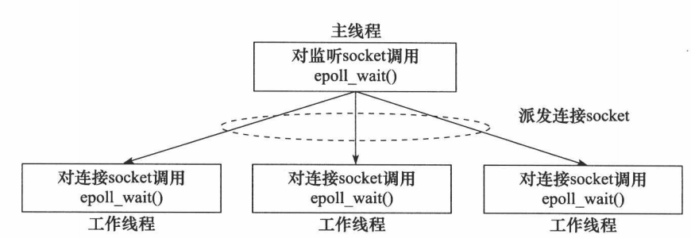

# C++ WebServer
## 简介

一个轻量的多线程Web服务器，使用C++11编写

## 开发环境

- 操作系统：Ubuntu 18.04 x64
- 编译器：g++ 7.5.0
- IDE:Clion
- 性能测试工具：Apache Benchmark

## 运行方法

```
make
./http_server --ip [ip_addr] --port [port_num] --thread-num [thread_num]
```

如忽略参数，则服务器ip默认为0.0.0.0，默认端口号为9833，默认工作线程数为1

## 技术点

- 基于Reactor事件处理模式实现
- 使用epoll+边沿触发(ET)+非阻塞I/O实现高并发处理客户端请求。
- 使用线程池提高并发度，避免频繁创建线程造成的开销
- 主线程仅负责监听并accept新连接，并将新连接通过轮转算法分配给其中一个工作线程处理，只有这一处的共享变量使用了互斥锁。
- 使用eventfd实现工作线程的异步唤醒
- 支持HTTP GET方法，以及简单回显功能的POST方法
- 使用RAII手法封装Socket类管理文件描述符，通过std::lock_guard使用互斥锁
- 使用shared_ptr和weak_ptr管理连接的生命周期
- 使用timerfd+时间轮实现定时器管理长连接，以及时踢除空闲连接

## 并发模型



图来自《Linux高性能服务器编程》（游双）。

本项目的并发模型与上图类似，唯一区别在于考虑到主线程仅负责accept，并未在主线程使用epoll。

在主线程监听到一个来自客户端的新连接之后，会通过轮转算法将其放入共享变量，并通过eventfd异步唤醒对应的工作线程开始处理。

每个工作线程中都含有一个EventLoop，以处理新连接、连接可读、连接可写、定时器四种事件。

## 版本说明

0.1：并未使用线程池和I/O复用机制，是比较简单的多线程网络编程模型，不支持高并发

0.2：基于0.1版本进行了一些模块的封装，使用Reactor模式重写处理逻辑，使用了epoll、线程池、RAII Socket等

0.3：在0.2版本的基础上加入了定时器管理长连接

